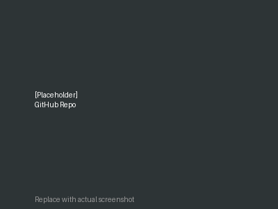
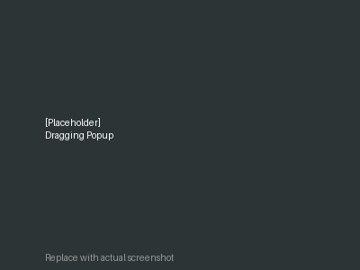
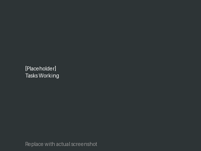

# Tada

A lightweight Chrome extension that adds a persistent task list popup to any website. Your tasks are saved locally and persist across browser sessions.

## Features

- **Persistent Storage**: All tasks are saved to browser local storage
- **Transparent Popup**: Glassmorphic sidebar with blur effect and hover transparency
- **Draggable**: Click and drag the popup header to reposition
- **Position Memory**: Remember your preferred popup position
- **Import/Export**: Download tasks as CSV or import from CSV file
- **Easy to Use**: Add tasks with Enter or click the Add button
- **Works Everywhere**: Appears on any website
- **Colored Icons**: Intuitive color-coded buttons in header
- **No Dependencies**: Pure vanilla JavaScript

## Screenshots

See Tada in action across different websites and use cases:

| GitHub Repo | AliExpress Popup | Draggable | Working |
|---|---|---|---|
|  |  |  |  |

**To replace placeholder images:**
1. Navigate to the `images/` folder on GitHub
2. Click each `.png` file
3. Click the pencil icon (Edit)
4. Click "Delete this file" and upload your screenshot
5. Or clone locally, replace images, and push back

Screenshots show:
- **github-repo.png** — Tada repository on GitHub with extension overview
- **aliexpress-popup.png** — Popup displayed on AliExpress shopping site
- **dragging.png** — User dragging the popup to a different position
- **tasks-working.png** — Tasks list with timestamps and delete buttons

## Installation

1. Clone or download this repository
2. Open Chrome and go to `chrome://extensions`
3. Enable "Developer mode" (toggle in top right)
4. Click "Load unpacked"
5. Select the `Tada` folder
6. The extension icon will appear in your toolbar

## Usage

1. Click the extension icon to toggle the popup
2. Type a task in the text field
3. Press Enter or click the **+** button to save the task
4. Click the **✕** button on any task to delete it
5. Use **⬇** to export tasks as CSV
6. Use **⬆** to import tasks from CSV file
7. Click **⚙** to open position selector and move popup to 9 different positions
8. Drag the header to move popup anywhere on screen
9. Your tasks persist when you refresh or close the browser

## Keyboard Shortcuts

- **Enter** — Add new task (while focused on input)
- **Click ⬇** — Export all tasks as CSV
- **Click ⬆** — Import tasks from CSV file
- **Click ⚙** — Position selector (3×3 grid)
- **Click ✕** (on task) — Delete task
- **Click ✕** (header) — Close popup

## File Structure

```
Tada/
├── manifest.json       # Extension configuration
├── background.js       # Service worker for storage & toggle
├── content-script.js   # Popup injection & interactions
├── popup.css          # Styling with glassmorphic design
├── icons/             # Extension icons (16x16, 48x48, 128x128)
├── README.md          # This file
└── LICENSE            # MIT License
```

## CSV Import/Export Format

**Export**: Creates a file named `tada-tasks-YYYY-MM-DD.csv`

```csv
Task,Created
"Buy groceries","1/15/2025, 2:30:45 PM"
"Fix bug","1/15/2025, 3:15:22 PM"
"Meeting notes","1/15/2025, 4:00:00 PM"
```

**Import**: Upload a CSV file with the same format. New tasks are added to existing ones.

## Technology

- **Manifest V3**: Latest Chrome extension standard
- **No Build Process**: Works directly from source
- **Local Storage**: `chrome.storage.local` API for persistence
- **Vanilla JavaScript**: Zero dependencies
- **CSS3**: Modern styling with backdrop filters and animations

## Position Selector

The 3×3 grid allows positioning in 9 locations:

```
[↖] [↑] [↗]     (Top-left, Top-center, Top-right)
[←] [•] [→]     (Middle-left, Center, Middle-right)
[↙] [↓] [↘]     (Bottom-left, Bottom-center, Bottom-right)
```

Selected position is saved and remembered across tabs.

## Popup Transparency

- **Default**: 24% opacity (very transparent)
- **On Hover**: 80% opacity (fully opaque)

Smooth transition when moving mouse in/out of popup.

## License

MIT License - see LICENSE file for details

---

Made with ❤️ for productivity.
